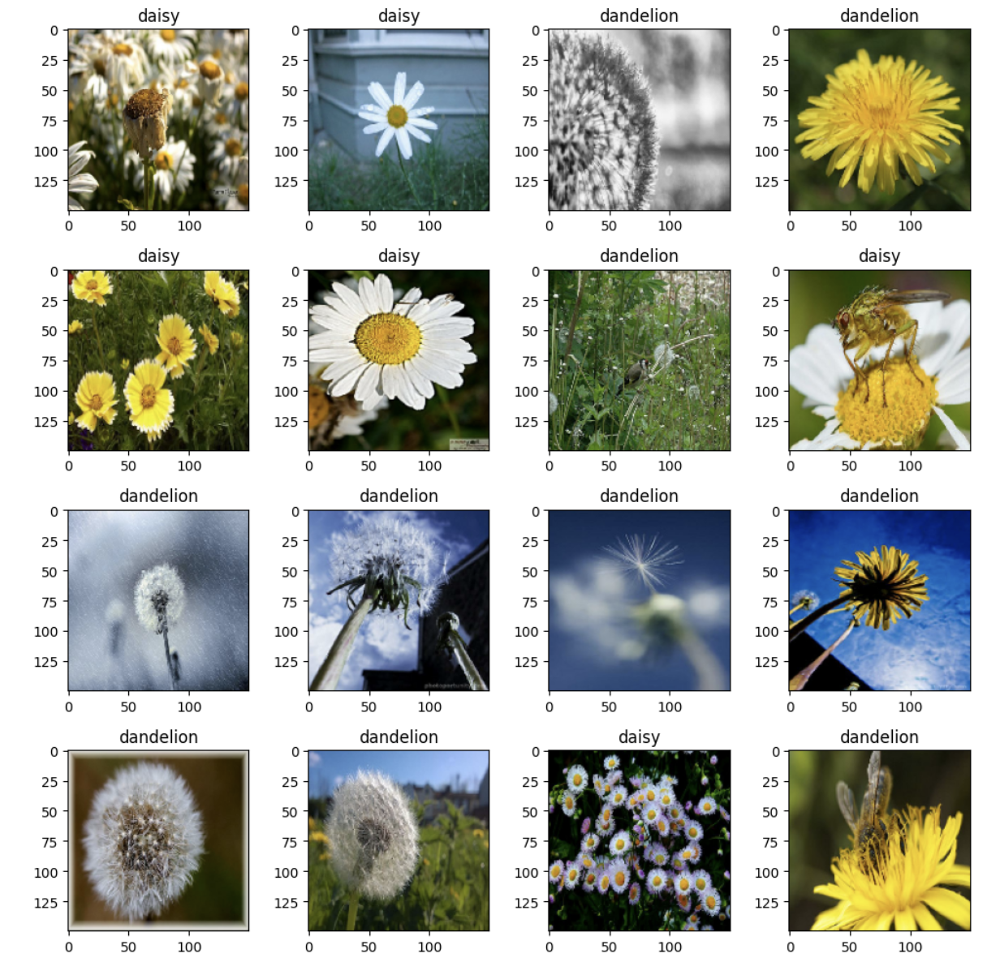
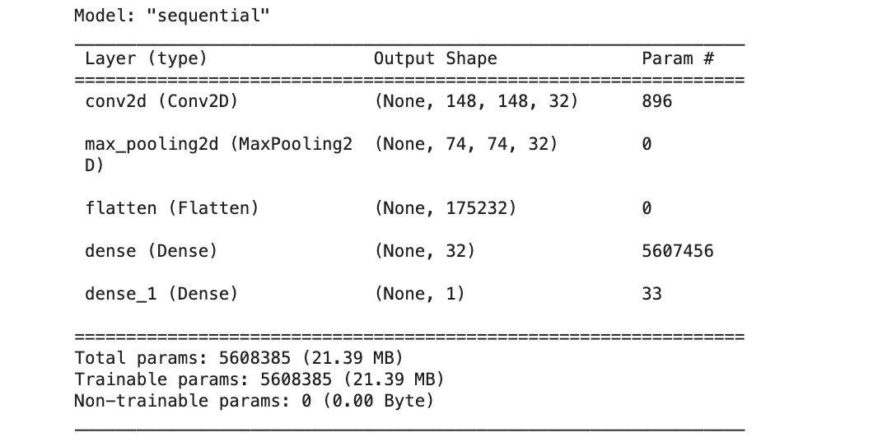
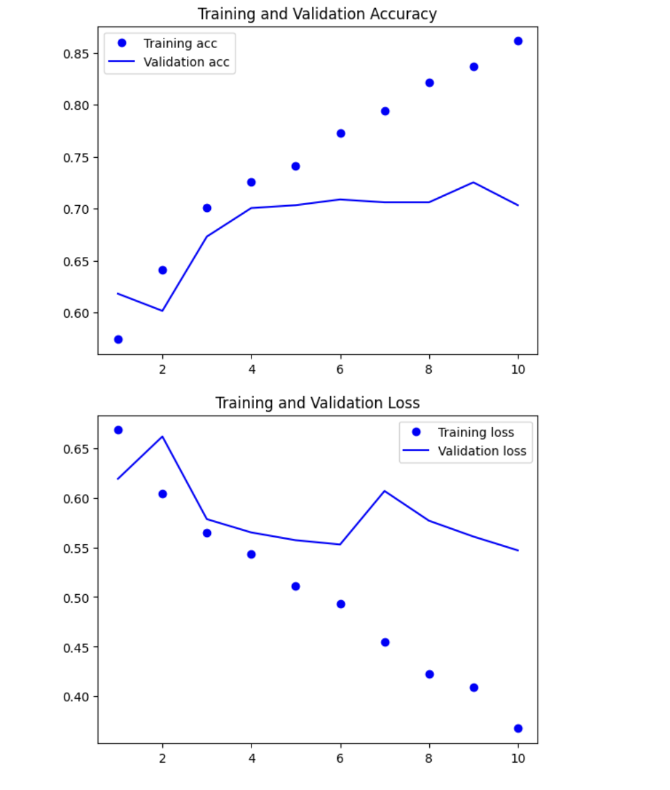
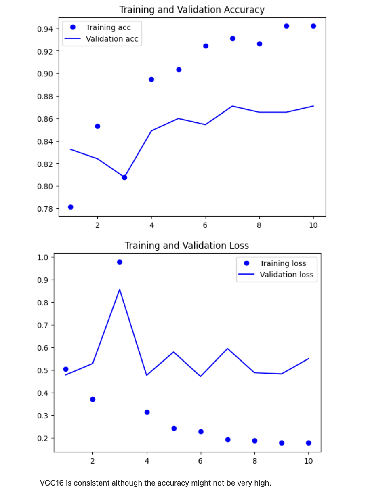
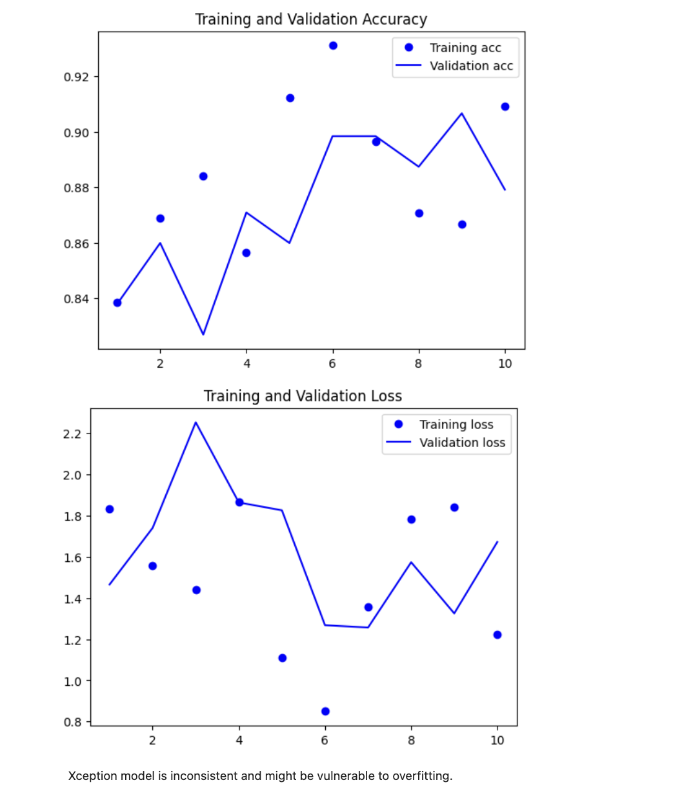
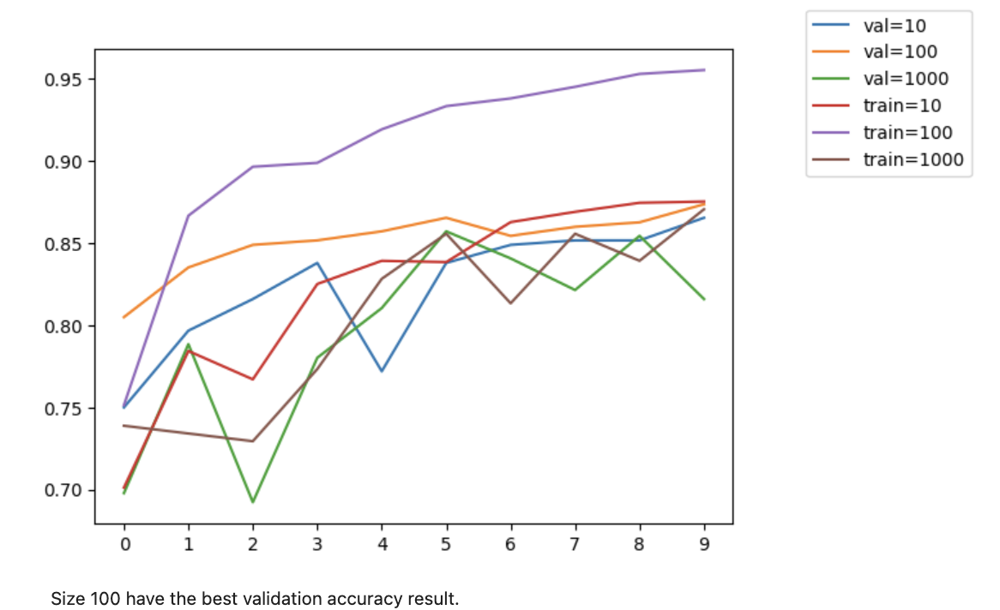
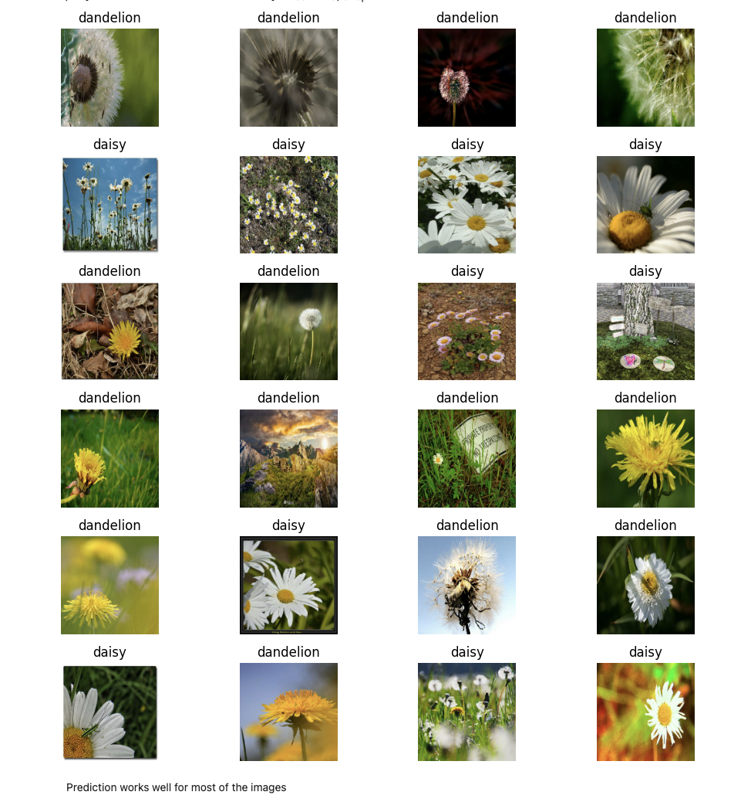

## Table of Contents
1. [Introduction](#flower-image-classification)
2. [Dataset](#dataset)
3. [Problem Description](#problem-description)
4. [Model Training](#model-training)
5. [Parameter Tuning](#parameter-tuning)
6. [Evaluation](#evaluation)
7. [Dependency and Environment Management](#dependency-and-environment-management)
8. [Containerization](#containerization)
9. [Usage](#usage)

# Flower-image-classification
Classification model for the flowers 'daisy' and 'dandelion'. This dataset is from Kaggle. <br><br>
https://www.kaggle.com/datasets/alsaniipe/flowers-dataset
<br><br>
The notebook was run in Kaggle. You can install the necessary libraries from requirements.txt, or you can run it in Kaggle.
<br><br>
The trained model is converted to Tensorflowlite for light usages.
# Dataset
Train dataset has 529 daisy images and 1275 dandelion images.<br>
Validation dataset has 1620 daisy images and 1821 dandelion images.<br>
Test dataset has 1352 daisy images and 1457 dandelion images.<br><br>

Here are a few sample images from the dataset.<br><br>

<br><br>

# Problem Description
This model intends to identify and differentiate between daisy and dandelion.
<br><br>
Example use cases: image detection IoT devices, gardening, environmental monitoring, mobile app for nature enthusiasts
<br><br>
# Model Training
Model is trained with sequential model with CNN, and pre-trained models- 'VGG16' and 'Xception'.<br><br>
Firstly, the keras model is built on my own with following features.<br>

<br><br>
However, using our own model, we need to add a lot more layers to gain high accuracy. It requires a lot of GPU resources. <br><br>
Here is my model's accuracy and loss during training.<br><br>

<br><br>
Therefore, I used transfer learning with existing models in keras - Xception and VGG16. 
<br><br>


<br><br>
According to the images, xception model is inconsistent and might be vulnerable to overfitting. Transfer learning with VGG16 seems like it has consistent accuracy and loss in both training and validation.<br>
So, VGG16 model is chosen as the final model.
<br><br>

# Parameter Tuning
After choosing VGG16, the model is fine tuned to find the best size for inner dense layer. <br><br>

<br><br>
Size 100 and 10 seems like the best inner dense layer for the model. I used size 10 for the final model and trained with 10 epoches. The best model is found in 10th epoch with 87.6% accuracy. 

# Evaluation
Here is evaluation of the model.<br><br>

<br><br>
When tested with the test dataset, the accuracy is 86.8% which is pretty acceptable. The model performs well in most of the images and performs worse if the flower in the image has a very small size. 
<br><br>
# Dependency and Environment Management
Dependencies are in 'pipfile'. To install dependencies, you need to create pipenv virtual environment.
<br><br>

```
pip install pipenv
```

```
pipenv --python 3.9
```

```
pipenv install
```

<br><br>

# Containerization
<br><br>
To build the docker file in local, use <br>

```
Docker build -t 'container_name' .
```
<br><br>
After containerization, the container can be deployed to Amazon ECS service.
<br><br>
With the deployed container in ECS, we can use AWS Lambda and use the model to classify between daisy and dandelion. 
<br><br>
# Usage
<br><br>
Clone the model in your device and can be used. If your device is not compatible with Tensorflow lite, you can run the repository in cloud services like saturncloud.

